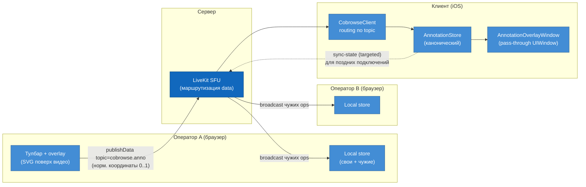

# Аннотации оператора — план работ

Документ описывает архитектуру и план реализации операторских аннотаций поверх
экрана клиента. Смежные документы: [архитектура](architecture.md),
[тестовый стенд](test-stand.md), [безопасность](security.md),
[P0 acceptance criteria](p0-acceptance-criteria.md).

## 1. Назначение и скоуп

**Задача.** Оператор техподдержки рисует поверх экрана клиента, чтобы показать
«нажмите вот сюда» / «заполните это поле». Аннотации появляются на экране iOS-приложения
клиента поверх его UI и одновременно видны всем операторам в co-viewing.

**Зафиксированный скоуп (решения от 2026-07-09 с Konstantin):**

- **Пять типов аннотаций:** свободное рисование (path), стрелка (arrow),
  текст (text), лазерная указка / живой курсор (pointer), фигуры-хайлайт
  (shape: прямоугольник и овал).
- **Мульти-оператор.** Несколько операторов (co-viewing, до 8 — см.
  `MAX_AGENTS_PER_SESSION`) рисуют одновременно, аннотации атрибутированы по автору
  и разноцветны. Требование заложено в протокол и модель хранения с первого дня.
- **Направление — только операторы пишут.** Клиент только отображает аннотации,
  не рисует. Это упрощает модель прав: клиент никогда не является автором,
  входящие ops от identity клиента игнорируются.

**Вне скоупа этой итерации:** landscape-ориентация (PoC жёстко портретный),
сохранение/запись аннотаций в Egress, редакция PII под аннотациями, remote control
(управление экраном). Guided pointer из прод-скоупа = наша лазерная указка.

## 2. Что уже готово в PoC (карта переиспользования)

Инфраструктура под аннотации в основном уже есть — data-канал разведён,
мульти-агент поддержан, координатная цепочка сохраняет пропорции. **Backend
менять не нужно.**

| Компонент | Статус | Что переиспользуем |
|---|---|---|
| Data-канал iOS | ✅ готов | `CobrowseTransport.sendData(_:topic:reliable:)` и `didReceiveData(_:topic:fromParticipantIdentity:)` уже в контракте; реализованы в `LiveKitTransport` через `publish(data:)` / `RoomDelegate.didReceiveData` |
| Data-канал web | ✅ готов | `livekit-client`: `room.localParticipant.publishData()` + `RoomEvent.DataReceived`; доступ через `useRoomContext()` |
| Права на data | ✅ готов | Backend выдаёт `canPublishData: true` и клиенту (`/session/create`), и всем агентам (`/agent/join`) |
| Мульти-агент | ✅ готов | Co-viewing до 8 агентов, у каждого уникальная `identity` (`agent-xxxxxx`), backend уже это разруливает |
| Роли участников | ✅ готов | В JWT `name`: `'Customer'` у клиента, `'Agent'` у оператора — по нему фильтруем, кто вправе писать |
| Сохранение пропорций | ✅ готов | `ScaledScreenShareCapturer` даунскейлит с сохранением aspect; web рендерит `object-fit: contain` — нормализованные координаты маппятся 1:1 |
| Точка внедрения iOS | 🔨 TODO | `CobrowseClient.didReceiveData` — комментарий «TODO P1: маршрутизировать по topic» ждёт нас |
| Точка внедрения web | 🔨 TODO | `web-agent/.../session/[code]/page.tsx` — комментарий «TODO P1: оверлей для аннотаций, лазерная указка» в `SessionView` |

Единственный файл с `import LiveKit` остаётся `LiveKitTransport.swift` — SDK-контракт
транспорт-нейтральный, аннотации ходят как «просто байты», без протечки LiveKit
в бизнес-логику.

## 3. Целевой data-flow

Аннотации идут тем же WebRTC-соединением, что и медиа, но по data-каналу
(SCTP), а не по видео-треку. Видео течёт клиент → оператор; аннотации —
оператор → клиент (и оператор → оператор для co-viewing).



Ключевые свойства:

- **Клиент — канонический стор.** iOS получает все ops и держит полное состояние
  (нужно всё равно для рендера). Поэтому именно клиент отвечает на `sync-req`
  при позднем подключении/реконнекте оператора (§6.3).
- **Операторы рендерят и свои, и чужие аннотации** (co-viewing): каждый агент
  подписан на `DataReceived` и мёржит чужие ops в свой local store.
- **Эхо через видео.** Overlay на клиенте попадает в кадр ReplayKit → оператор
  видит свою аннотацию ещё и «отражённой» в видео (round-trip). Это фича
  (неявный ACK), а не баг; чтобы не было лага — оператор рендерит свои ops
  оптимистично локально (§8).

## 4. Система координат — ядро задачи

Всё завязано на **нормализованные координаты `[0.0 … 1.0]`** относительно
контент-бокса видео. Пропорции сохраняются по всей цепочке, поэтому нормализованная
точка маппится пиксель-в-пиксель без искажений независимо от разрешения и
letterbox'а.

**Захват (iOS).** ReplayKit in-app снимает окно приложения; `ScaledScreenShareCapturer`
даунскейлит с сохранением пропорций (короткая сторона = `targetShortSide`).
Контент видео-кадра = ровно окно приложения. Значит норм. точка `(nx, ny)`
маппится в точку экрана как `CGPoint(nx * W, ny * H)`, где `W×H` — bounds
overlay-окна (совпадает с захватываемым окном).

**Отправка (web).** Событие мыши `(clientX, clientY)` → норм. координата с учётом
letterbox'а `object-fit: contain`:

```
rect      = videoEl.getBoundingClientRect()
vidAR     = trackDimensions.width / trackDimensions.height   // intrinsic
scale     = min(rect.width / vidW, rect.height / vidH)
contentW  = vidW * scale;  contentH = vidH * scale
contentX  = rect.left + (rect.width  - contentW) / 2
contentY  = rect.top  + (rect.height - contentH) / 2
nx = clamp((clientX - contentX) / contentW, 0, 1)
ny = clamp((clientY - contentY) / contentH, 0, 1)
```

События вне контент-бокса (по letterbox-полосам) игнорируются. SVG-overlay
позиционируется ровно в `content{X,Y,W,H}` и пересчитывается на `resize` и смене
размеров трека, поэтому визуально аннотации всегда поверх правильного места.

**Размеры тоже нормализованы.** Толщина линии и кегль текста задаются как доля
короткой стороны контента (напр. `strokeWidth = 0.006`), чтобы одинаково
выглядеть и в браузере (большой экран), и на iPhone.

**Ограничение.** PoC портретный — ориентация фиксирована. Landscape (смена
aspect на лету) — отдельная доработка: и захват, и overlay должны пересчитывать
бокс на поворот. Вынесено из скоупа, отмечено в рисках.

## 5. Протокол сообщений

Топик LiveKit: **`cobrowse.anno`**. Одно логическое русло, надёжность выбирается
per-message флагом `reliable`.

**Конверт (JSON, UTF-8):**

```jsonc
{
  "v": 1,                     // версия протокола
  "op": "add|append|end|remove|clear|pointer|sync-req|sync-state",
  "author": "agent-ab12cd",   // = participant identity (дубль к LiveKit sender)
  "id": "agent-ab12cd:37",    // стабильный id аннотации (счётчик в рамках автора)
  "ts": 1720000000000
  // + поля в зависимости от op / kind (см. ниже)
}
```

**Полезная нагрузка по типам (`add`):**

| kind | Поля | Жизненный цикл |
|---|---|---|
| `path` (рисование) | `color`, `w` (норм. толщина), `pts:[[nx,ny],…]` | `add` (старт + первые точки) → `append` (докидываем батчи точек) → `end` (финализация) |
| `arrow` (стрелка) | `color`, `w`, `from:[nx,ny]`, `to:[nx,ny]` | `add` при нажатии → `append`/`update` двигаем `to` при драге → `end` |
| `text` | `color`, `size`, `at:[nx,ny]`, `text` | `add` при постановке → `append` при редактировании текста → `end` |
| `shape` (фигура) | `color`, `w`, `shape:"rect"\|"ellipse"`, `from`, `to`, `fill?` | как `arrow` (два угла) |
| `pointer` (указка) | `color`, `at:[nx,ny]` | отдельный `op:"pointer"`, шлётся lossy ~20–30 Гц; авто-фейд ~1 с после последнего апдейта; у автора одна активная указка |

**Управляющие ops:**

- `remove {id}` — удалить конкретную аннотацию (в т.ч. как реализация Undo:
  оператор жмёт Undo → шлём `remove` последней своей аннотации).
- `clear {scope:"own"|"all"}` — снять все свои (или все вообще — permissioned, §6.4).
- `sync-req` / `sync-state {items:[…]}` — ресинк позднего подключения (§6.3).

**Надёжность:**

- **reliable = true:** `add`(старт фигуры/текста), `end`, `remove`, `clear`,
  `sync-state` — критично не потерять.
- **reliable = false (lossy):** `pointer`, промежуточные `append` штриха/драга —
  высокочастотные, потеря отдельного апдейта незаметна, `end` всё равно донесёт
  финальную геометрию.

**Размер сообщений.** Рекомендованный практический предел data-пакета LiveKit —
единицы КБ. Длинные штрихи не шлём целиком: батчим точки (напр. каждые ~50 мс или
каждые N точек) через `append`, финальную геометрию фиксируем в `end`. Это же
бережёт CPU рендера на клиенте.

## 6. Модель мульти-юзера

### 6.1 Авторство и цвета

Автор берётся из `fromParticipantIdentity` (LiveKit), дублируется в поле `author`
для устойчивости. Цвет назначается **детерминированно хэшом identity** по палитре
из 8 контрастных цветов (= максимум агентов) — без координации между операторами,
у всех одинаковая раскраска. На web показываем легенду-ростер (у нас уже есть
`AgentRoster`) с цветовой меткой каждого оператора.

### 6.2 Конкурентность

Хранилище **append-only по ключу `(author, id)`**. Два оператора, рисующие
одновременно, не конфликтуют — id скоупнуты автором. `append`/`update` мёржатся по
id (last-writer-wins для одного id). Единственная разделяемая мутация —
`clear scope:"all"`.

### 6.3 Позднее подключение и реконнект (ресинк)

Оператор, вошедший в середину сессии (или переподключившийся после F5/сети), должен
увидеть уже нарисованное:

1. При коннекте web шлёт `sync-req` (reliable, broadcast).
2. **Клиент (канонический стор) отвечает `sync-state`** со списком всех активных
   аннотаций (без эфемерных указок), адресно новому агенту через
   `destinationIdentities` (targeted delivery LiveKit).
3. Web применяет `sync-state` к local store и дорисовывает.

Клиент как единственный источник истины исключает гонки «кто ответит» между
операторами и естественно покрывает reconnect.

### 6.4 Права и очистка

- **Только операторы пишут.** На приёме (и на iOS, и на web) ops от участника с
  `name == 'Customer'` игнорируются. Клиент никогда не автор.
- **Авто-очистка при уходе автора.** По `participantDisconnected` (LiveKit) стор
  удаляет аннотации ушедшего оператора, чтобы не висели «осиротевшие» метки.
- **`clear scope:"all"`** — открытый вопрос политики: разрешить любому оператору
  или только «ведущему». На PoC разрешаем любому, но логируем автора очистки
  (см. §12).

## 7. Спецификация типов аннотаций

- **Рисование (path).** Свободная кривая. Оператор ведёт мышью → батчи точек
  `append` (lossy), финал `end` (reliable). Рендер — сглаженная polyline.
- **Стрелка (arrow).** Прямая с наконечником. Нажатие ставит хвост, драг тянет
  остриё (`to` обновляется lossy), отпускание фиксирует. Наконечник рисуется на
  стороне получателя из `from`/`to`.
- **Текст (text).** Оператор кликает точку, печатает в инлайн-поле на web; текст
  едет как строка, рендерится на клиенте выбранным цветом и норм. кеглем. Длина
  ограничена (напр. 200 символов), содержимое санитизируется.
- **Лазерная указка (pointer).** Эфемерная точка, следует за курсором оператора в
  реалтайме (lossy ~20–30 Гц), плавно гаснет через ~1 с без апдейтов. Ничего не
  остаётся на экране. У каждого оператора своя указка своего цвета.
- **Фигуры-хайлайт (shape).** Прямоугольник или овал для выделения области —
  контур + опционально полупрозрачная заливка. Живёт до `remove`/`clear`.
  Ввод как у стрелки (два угла).

Все пять рендерятся из одного нормализованного стора и на iOS, и на web —
разница только в платформенном слое отрисовки.

## 8. iOS: архитектура overlay

- **`AnnotationOverlayWindow`** — отдельный `UIWindow`, `windowLevel = .normal + 1`
  (над контентом приложения, под системными алертами), `isUserInteractionEnabled = false`
  → полностью pass-through: оператор рисует, клиент продолжает пользоваться
  приложением сквозь слой. Окно кроет весь bounds → 1:1 с захватываемым кадром.
- **`AnnotationStore`** (`ObservableObject`) — канонический стор аннотаций,
  наполняется из `CobrowseClient.didReceiveData`, маршрутизированного по топику
  `cobrowse.anno`. Отвечает на `sync-req`. Чистит по `participantDisconnected`.
- **Рендер** — `Canvas`/`CAShapeLayer`: path, arrow, text, shape из норм. координат
  × bounds; pointer с таймером фейда.
- **SDK routing.** Реализуем существующий TODO в `didReceiveData`: декод конверта,
  диспетчеризация по `op`, применение к стору. Транспорт остаётся нейтральным —
  парсинг протокола живёт над транспортом. Хост-приложение монтирует overlay-окно
  на входе в `.streaming` и снимает на `.ended`/`.error`.
- **Эхо-компенсация.** Аннотации клиента попадают в видео ReplayKit; чтобы у
  оператора не было round-trip лага, web рисует свои ops оптимистично сразу
  (§9), а видео-эхо служит подтверждением. Исключить overlay из in-app capture
  штатно нельзя — это отдельный композитинг-путь, вне скоупа.

## 9. Web: архитектура overlay

- **SVG-overlay** (векторный, чёткий текст, простой хит-тест) абсолютно
  позиционируется над контент-боксом видео (§4), пересчитывается на resize/смену
  dims трека.
- **Тулбар:** выбор инструмента (рисование / стрелка / текст / прямоугольник /
  овал / указка / undo / clear). Цвет — авто по своей identity (свой цвет
  оператора).
- **Ввод:** `pointerdown/move/up` на overlay → построение норм. ops → `publishData`
  (`reliable` для финалов, lossy для стриминга/указки). Свои ops рендерятся
  **оптимистично** сразу.
- **Приём:** подписка на `RoomEvent.DataReceived`, фильтр по топику, декод, мёрж
  чужих ops (co-viewing) в тот же local store и рендер.
- **Ресинк:** на коннекте шлём `sync-req`, применяем `sync-state` от клиента.

## 10. Тикеты

Формат Given/When/Then, готово к переносу в Jira/Linear. Префикс `ANNO`.

---

### ANNO-0 — Общий протокол и координатная модель

**Описание.** Зафиксировать схему сообщений, координатную математику и топик;
типы на TS и Swift (общий контракт двух сторон).

**Acceptance criteria**

- **Given** спецификация протокола **When** ревью **Then** описаны все `op`,
  типы `kind`, поля, правила `reliable`, версия `v:1`, лимиты размера/длины текста
- **Given** норм. координата `(nx,ny)` **When** прогнать через web→iOS маппинг в
  юнит-тесте **Then** обратный маппинг совпадает с точностью до 1 px при разных
  разрешениях и letterbox'ах
- **Given** типы протокола **When** собрать iOS и web **Then** декод/энкод конверта
  проходит round-trip тест на обеих сторонах

**Артефакты:** `docs/annotations-plan.md`, `ios/.../Annotation*.swift` (модели),
`web-agent/.../lib/anno.ts`

**Оценка:** 1 день

---

### ANNO-1 — iOS: overlay-инфраструктура

**Описание.** `AnnotationOverlayWindow` (pass-through) + `AnnotationStore` +
пустой рендер-слой, монтаж/демонтаж по состоянию сессии.

**Acceptance criteria**

- **Given** сессия в `.streaming` **When** SDK стартует **Then** поверх приложения
  появляется прозрачное pass-through окно; тапы проходят в приложение (клиент
  пользуется UI как обычно)
- **Given** сессия ушла в `.ended`/`.error` **When** **Then** окно снимается, стор
  очищается
- **Given** норм. точка `(0.5,0.5)` в сторе **When** рендер **Then** маркер ровно
  в центре окна на любом устройстве

**Артефакты:** `ios/.../AnnotationOverlayWindow.swift`, `AnnotationStore.swift`

**Зависимости:** ANNO-0

**Оценка:** 2 дня

---

### ANNO-2 — iOS: routing + рендер всех типов

**Описание.** Реализовать TODO в `didReceiveData`; декод, диспетчеризация по `op`,
рендер path/arrow/text/shape и pointer с фейдом.

**Acceptance criteria**

- **Given** оператор нарисовал линию **When** ops дошли **Then** на экране клиента
  та же кривая тем же цветом в тех же местах (±1 px)
- **Given** оператор двигает указку **When** идут lossy `pointer` **Then** точка
  следует за курсором с задержкой < 150 мс и гаснет через ~1 с после остановки
- **Given** ops с `author.name == 'Customer'` (спуфинг) **When** приём **Then**
  игнорируются (пишут только операторы)
- **Given** стрелка/прямоугольник/овал/текст **When** приём **Then** каждый тип
  корректно отрисован (наконечник, контур, кегль)

**Артефакты:** `ios/.../CobrowseClient.swift` (didReceiveData),
`AnnotationRenderer.swift`

**Зависимости:** ANNO-1

**Оценка:** 3 дня

---

### ANNO-3 — Web: overlay-слой и рендер входящих

**Описание.** SVG-overlay над контент-боксом видео, letterbox-математика, ресайз;
рендер входящих аннотаций всех типов + указка.

**Acceptance criteria**

- **Given** видео с letterbox **When** overlay смонтирован **Then** его бокс точно
  совпадает с контентом видео, аннотации поверх правильных мест
- **Given** окно браузера ресайзится / меняются dims трека **When** **Then** бокс и
  все аннотации пересчитываются без рассинхрона
- **Given** входящие ops от другого оператора **When** приём **Then** отрисованы его
  цветом (co-viewing видит друг друга)

**Артефакты:** `web-agent/.../session/[code]/page.tsx` (overlay-компонент)

**Зависимости:** ANNO-0

**Оценка:** 2 дня

---

### ANNO-4 — Web: тулбар, ввод и отправка

**Описание.** Инструменты (рисование/стрелка/текст/фигуры/указка/undo/clear),
построение ops, отправка (reliable/lossy), оптимистичный локальный рендер.

**Acceptance criteria**

- **Given** выбран инструмент рисования **When** оператор ведёт мышью **Then**
  кривая появляется у него сразу (оптимистично) и уходит батчами `append` + `end`
- **Given** инструмент текста **When** клик и ввод **Then** инлайн-поле, по
  подтверждению — `add`/`end` с текстом
- **Given** нажат Undo **When** **Then** последняя своя аннотация исчезает (шлётся
  `remove`), чужие не трогаются
- **Given** нажат Clear (own) **When** **Then** снимаются только свои аннотации
- **Given** указка **When** оператор двигает мышь над видео **Then** шлётся lossy
  `pointer` ~20–30 Гц

**Артефакты:** `web-agent/.../session/[code]/page.tsx` (toolbar + input)

**Зависимости:** ANNO-3

**Оценка:** 3 дня

---

### ANNO-5 — Мульти-юзер: цвета, ростер, конкурентность, очистка

**Описание.** Детерминированные цвета по identity, цветовая легенда в ростере,
конкурентные штрихи без конфликтов, `clear` scope own/all, авто-удаление при уходе
автора.

**Acceptance criteria**

- **Given** 3 оператора рисуют одновременно **When** **Then** три набора аннотаций,
  каждый своего цвета, без перемешивания и потерь; видны и на клиенте, и у всех
  операторов
- **Given** оператор покинул сессию **When** `participantDisconnected` **Then** его
  аннотации снимаются у всех в течение ~1 с
- **Given** один цвет на identity **When** тот же оператор рисует снова **Then**
  цвет стабилен между штрихами и после реконнекта

**Артефакты:** iOS `AnnotationStore.swift`, web overlay + `AgentRoster`

**Зависимости:** ANNO-2, ANNO-4

**Оценка:** 1.5 дня

---

### ANNO-6 — Ресинк позднего подключения и реконнекта

**Описание.** `sync-req`/`sync-state`, клиент как канонический источник, targeted
delivery.

**Acceptance criteria**

- **Given** на экране клиента уже 5 аннотаций **When** новый оператор входит по
  коду **Then** в течение ~1 с он видит все 5 (без эфемерных указок)
- **Given** оператор сделал F5 **When** viewer перезагрузился **Then** аннотации
  восстановились из `sync-state`, дубликатов нет
- **Given** `sync-state` **When** отправка **Then** адресно запросившему
  (`destinationIdentities`), а не broadcast'ом всем

**Артефакты:** iOS `AnnotationStore.swift`, web overlay

**Зависимости:** ANNO-2, ANNO-4

**Оценка:** 1.5 дня

---

### ANNO-7 — E2E приёмка и производительность

**Описание.** Сквозные сценарии, латентность, размеры, деградация lossy,
одновременная работа, ресайз.

**Acceptance criteria**

- **Given** оператор рисует **When** измерить путь оператор→клиент **Then**
  визуальная задержка появления < 200 мс на 4G
- **Given** длинный непрерывный штрих **When** он идёт **Then** сообщения батчатся,
  ни одно не превышает лимит пакета, рендер клиента не проседает
- **Given** 3+ оператора + активная указка **When** нагрузка **Then** нет заметных
  фризов видео (data-канал не голодит медиа)
- **Given** потеря части lossy-апдейтов **When** сеть подсаживается **Then**
  финальная геометрия (`end`) всё равно корректна

**Артефакты:** `docs/annotations-plan.md` (чек-лист приёмки), тестовые заметки

**Зависимости:** ANNO-5, ANNO-6

**Оценка:** 1.5 дня

## 11. Итог по оценке

| | |
|---|---|
| **Тикетов** | 8 (ANNO-0 … ANNO-7) |
| **Суммарная оценка** | ~15.5 инж-дней |
| **Реалистичный календарный срок** | 3–4 недели (с ревью, device-тестами, дебагом сети) |
| **Состав** | 1 iOS + 1 frontend, парт-тайм shared на протокол (ANNO-0). Backend не задействован |
| **Критический путь** | ANNO-0 → (ANNO-1→ANNO-2) ∥ (ANNO-3→ANNO-4) → ANNO-5/6 → ANNO-7 |

Тикет в общий прод-скоуп: это и есть реализация пункта «annotations + guided pointer»
из [scope-оценки](p0-acceptance-criteria.md) программы (~135 инж-дней) — здесь он
приземляется на текущий iOS+web PoC.

## 12. Риски и открытые вопросы

- **Landscape / поворот.** PoC портретный; смена aspect на лету не поддержана.
  При повороте устройства маппинг координат «поплывёт». Нужна доработка захвата и
  обоих overlay (пересчёт бокса на поворот) — вынесено из скоупа.
- **Видео-эхо overlay.** Аннотации клиента попадают обратно в кадр (round-trip).
  Митигация — оптимистичный локальный рендер на web. Полностью исключить overlay
  из in-app capture штатно нельзя.
- **Политика `clear all`.** Кто вправе стереть чужие аннотации при нескольких
  операторах — любой или «ведущий»? На PoC: любой + лог автора. Нужно решение для
  прод-RBAC.
- **Размер/частота data.** ✅ Закрыто в ANNO-7. Указка и стриминг штрихов
  высокочастотны — держим lossy + батчинг; финальный `end` квантуется (4 знака)
  и упрощается по Ramer–Douglas–Peucker с жёстким капом 400 точек. Без этого
  штрих на 800 сырых точек весил бы ~32 КБ при практическом лимите пакета 15 КБ.
- **Текст и приватность.** Аннотации могут перекрывать PII; в записи (Egress, вне
  скоупа) это всплывёт. Редакция PII по-прежнему вне скоупа (см. security.md).
- **Спуфинг автора.** ✅ Смягчено. Поле `author` из payload игнорируется: на обеих
  сторонах оно перезаписывается аутентифицированной identity отправителя
  (LiveKit проверяет её по JWT), поэтому оператор не может выдать себя за другого
  или тронуть чужие аннотации. Роль (`name=='Customer'`) дополнительно гейтит,
  кто вправе писать. Это app-level, не крипто — достаточно для PoC.

## 13. Чек-лист E2E-приёмки (ANNO-7)

**Стенд.** Прод-контур `mvirtual.cc` (или dev-стек по [infra/README.dev.md](../infra/README.dev.md)),
iPhone с собранным `CobrowseTestApp`, 2–3 независимых окна оператора.
Важно: `agentId` живёт в `sessionStorage`, поэтому для разных операторов нужны
**разные вкладки в режиме инкогнито или разные браузеры** — простые вкладки
одного профиля переиспользуют один agentId.

**Инструменты замера (уже в UI).**

- Панель `anno tx/rx` справа-снизу в viewer'е: число сообщений, объём, **максимальный размер пакета**.
- `DebugHUD` слева-снизу: fps / битрейт / RTT видеопотока.
- Консоль браузера: предупреждение `[anno] пакет …B > лимита …B` (не должно появляться).

| # | Проверка | Процедура | Ожидаемый результат |
|---|---|---|---|
| 1 | **AC1 — латентность** | Оператор рисует стрелку. Снять на камеру экран телефона и экран оператора одновременно, посчитать кадры до появления | < 200 мс на 4G. **Мерить по появлению на самом устройстве**, а не по эху в видеопотоке — эхо включает round-trip видео и метрикой аннотаций не является |
| 2 | **AC2 — размер пакетов** | Нарисовать длинный непрерывный штрих через весь экран | `max msg` в панели < 15000 B, предупреждений в консоли нет. Референс (замерено): 800 сырых точек → 112 точек / 1.9 КБ; 3000 → 310 точек / 5.0 КБ; батч `append` 32 точки ≈ 1.4 КБ; `pointer` ≈ 104 B |
| 3 | **AC3 — нагрузка** | 3 оператора одновременно: двое рисуют, третий водит указкой | В `DebugHUD` fps и битрейт видео не проседают, RTT стабилен; нет видимых фризов |
| 4 | **AC4 — потеря lossy** | DevTools → Network throttling (Slow), вести штрих и отпустить | После отпускания кривая совпадает с нарисованной (её чинит `end` с полной геометрией). Юнит-покрытие: тест «AC4: потеря lossy-append…» |
| 5 | **Ресинк (ANNO-6)** | Нарисовать 5 аннотаций → открыть нового оператора; затем F5 на его вкладке | Новый видит все 5 (без указок) в пределах ~1 с; после F5 — восстановление без дубликатов (`items` не удваивается) |
| 6 | **Уход оператора (ANNO-5)** | Закрыть вкладку одного из операторов | Его аннотации исчезают и на телефоне, и у остальных операторов |
| 7 | **Ресайз / letterbox** | Менять размер окна, войти в fullscreen | Аннотации остаются привязаны к тем же местам картинки, без смещения |
| 8 | **Права** | — | У клиента нет UI рисования; ops от клиента отбрасываются, `sync-state` принимается только от него |

**Ограничения, действующие на приёмке:**

- **Только портретная ориентация** — landscape вне скоупа, при повороте координаты поплывут.
- **Эхо overlay в видеопотоке** — ожидаемое поведение (in-app capture снимает и слой аннотаций).
- **`clear all` доступен любому оператору** (с подтверждением и логом) — политика для прод-RBAC не определена.
