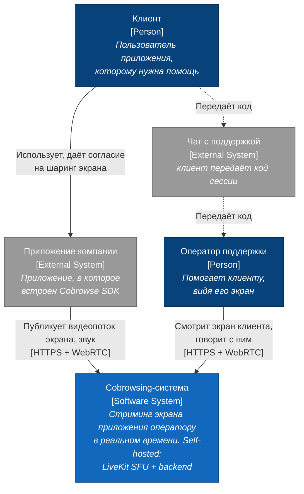
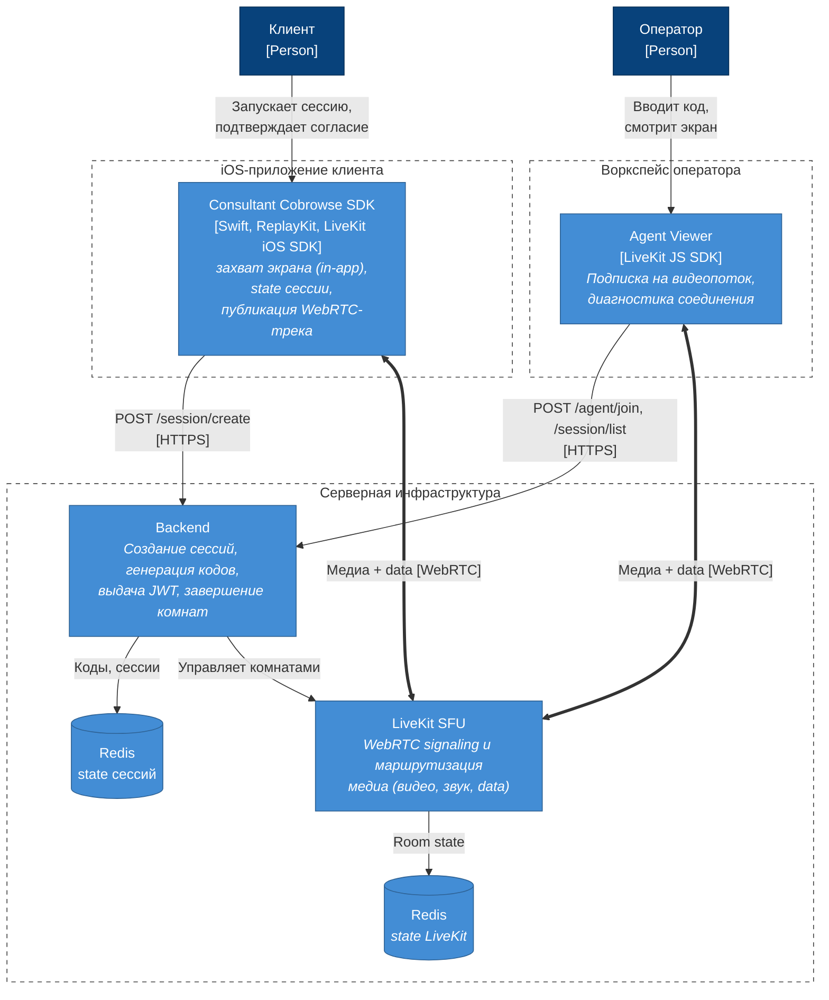
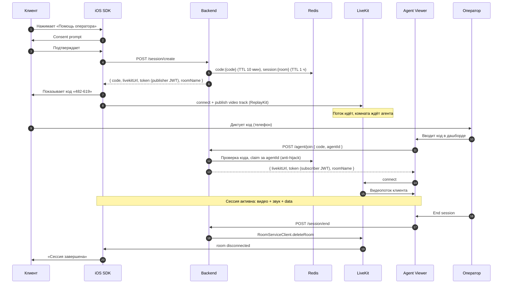

# Архитектурный обзор решения

Документ описывает целевую архитектуру cobrowsing-решения. Смежные документы: [тестовый стенд](test-stand.md),
[безопасность](security.md), [развёртывание](deployment.md).

## 1. Назначение и скоуп

**Задача:** оператор техподдержки видит экран iOS-приложения клиента в реальном
времени и голосом помогает пройти сценарий. Клиент явно даёт согласие и диктует
оператору короткий код сессии.

**Подход:** video-streaming cobrowsing — экран приложения захватывается через
ReplayKit (in-app capture, только своё приложение) и передаётся как WebRTC
видеопоток через self-hosted SFU (LiveKit) в браузер оператора.

## 2. Решение в двух абзацах

Клиент нажимает «Помощь оператора» в приложении, подтверждает согласие и
получает 6-значный код. SDK начинает публиковать видеопоток экрана в комнату
LiveKit. Клиент диктует код оператору (по телефону), оператор вводит его в
web-дашборде и подключается к той же комнате как подписчик. Двусторонний звук —
опционально, тем же WebRTC-соединением.

Вся инфраструктура self-hosted: LiveKit SFU (медиа), Backend и хранилища данных. Никакие данные не проходят через сторонние
сервисы.

## 3. C4 Level 1 — System Context

Легенда (C4 Level 1): синие тёмные блоки — люди, синий — описываемая система,
серые — внешние системы; пунктир — внеполосный канал.

Границы системы: cobrowsing-система не имеет собственной пользовательской базы
и аутентификации клиентов — она встраивается в существующее приложение и
существующий процесс поддержки. Единственная точка сопряжения с внешним миром —
код сессии, передаваемый по внеполосному каналу (телефон).

## 4. C4 Level 2 — Container

Легенда (C4 Level 2): рамки-пунктиры — границы исполнения (устройство клиента,
VPS, браузер оператора), голубые блоки — контейнеры, цилиндр — хранилище;
жирные стрелки — медиапоток WebRTC, обычные — HTTP/WS.

## 5. Жизненный цикл сессии

Свойства протокола, проверенные на стенде:

- `/agent/join` **идемпотентен** по паре (code, agentId): F5 в браузере, React
  StrictMode double-mount и сетевые ретраи не ломают сессию. Код, занятый
  другим агентом, возвращает 409.
- **iOS state machine restartable**: `idle → requestingConsent → connecting →
  streaming → ended/error`, из любого терминального состояния можно стартовать
  заново без перезапуска приложения. Авто-reconnect LiveKit отражается как
  `reconnecting(code)`.
- Завершить сессию может любая сторона; комната c пустым составом удаляется
  сервером через 5 минут (`empty_timeout`).

## 6. Ключевые архитектурные решения

### 6.1 Self-hosted LiveKit, а не managed-сервис

Полный контроль над данными (требование финсектора/healthcare), фиксированная
стоимость VPS вместо per-minute pricing, готовность к enterprise-запросу
«разверните в нашем VPC». Цена: сами отвечаем за эксплуатацию, мониторинг и
масштабирование. Миграция на LiveKit Cloud возможна без изменения клиентского
кода.

### 6.2 LiveKit, а не mediasoup/Janus/raw libwebrtc

Production-ready SDK для всех платформ, встроенная JWT-аутентификация,
server SDK для управления комнатами, Egress-сервис для будущей записи,
Apache 2.0. Это самый быстрый путь к работающему решению.

### 6.3 Транспорт изолирован за протоколом `CobrowseTransport`

Единственный файл с `import LiveKit` — `ios/.../LiveKitTransport.swift`.
Бизнес-логика (`CobrowseClient.swift`) работает через транспорт-нейтральный
контракт. Смена транспорта (raw libwebrtc, mediasoup) — замена одного файла и
одной строки в `convenience init`. Это страховка от vendor lock-in на уровне
кода, дополняющая self-hosted подход на уровне инфраструктуры.

### 6.4 Video-streaming (ReplayKit), а не scene-graph

Захватываем пиксели экрана, а не дерево UI-элементов. Осознанный trade-off:

| | Video-streaming (наш выбор) | Scene-graph (Cobrowse.io) |
|---|---|---|
| Сложность реализации | Низкая — ReplayKit + WebRTC | Высокая — сериализация UI |
| Redaction (маскирование PII) | Сложно, пост-фактум по областям | Архитектурно встроено (private-by-default) |
| Bandwidth | Выше (видеокодек) | Ниже (диффы дерева) |
| Точность отображения | Пиксель-в-пиксель, включая WebView/канвас | Зависит от покрытия типов элементов |

Для первого работающего решения скорость реализации важнее. Redaction — главный известный долг подхода
(см. [security.md](security.md)).

### 6.5 TURN отключён

SFU на публичном IP + открытый UDP-диапазон + TCP fallback :7881 покрывают
~95% сетей. TURN нужен только для сетей «только TCP/443» и части CGNAT —
шаблон конфига закомментирован в `infra/livekit.yaml`, включение — 15 минут.

## 7. Ограничения PoC

Осознанно не реализовано (и не тестировалось): HA/мультинодовость, staging,
запись сессий (Egress), remote control (управление экраном клиента),
аннотации оператора поверх видео, redaction PII, RBAC операторов,
интеграция с CRM/helpdesk. Часть из этого — кандидаты на следующую итерацию,
оценка гэпов по безопасности — в [security.md](security.md).

## 8. Требования к ресурсам

| Масштаб | CPU | RAM | Канал |
|---|---|---|---|
| PoC (до 10 одновременных сессий) | 2 vCPU | 4 GB | 100 Мбит/с |
| Pilot (до 50 сессий) | 4 vCPU | 8 GB | 500 Мбит/с |
| Prod (100+ сессий) | 8+ vCPU, multi-node | 16+ GB | 1 Гбит/с+ |

Узкое место SFU — bandwidth, не CPU. Текущий стенд (Hetzner CX22: 2 vCPU/4 GB)
соответствует строке «PoC» — детали в [test-stand.md](test-stand.md).
