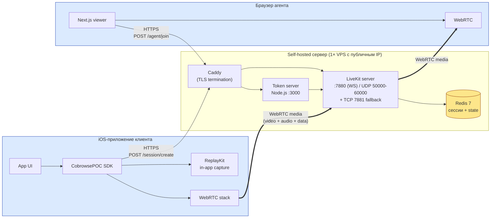
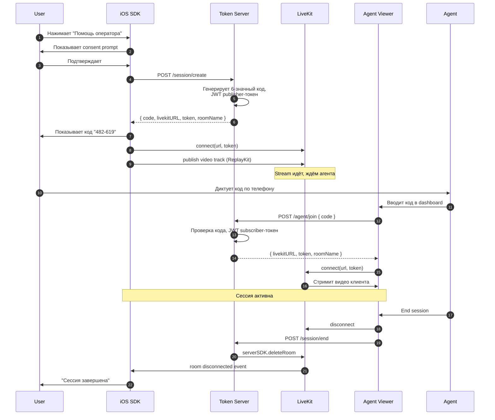

# Архитектура POC

## Высокоуровневая диаграмма компонентов

## Поток данных: жизненный цикл сессии

## Сетевые требования к серверу

| Порт | Протокол | Назначение | Внешний доступ |
|---|---|---|---|
| 443 | TCP | HTTPS (Caddy → Token + LiveKit WS upgrade) | да |
| 80 | TCP | HTTP → редирект на 443, ACME challenge | да |
| 7881 | TCP | LiveKit TCP fallback для WebRTC (сети без UDP) | да |
| 50000-60000 | UDP | WebRTC media (range) | да |
| 6379 | TCP | Redis | **нет** (internal) |
| 3000 | TCP | Token server | нет (через Caddy) |
| 7880 | TCP | LiveKit native (WS) | нет (через Caddy) |

Открыть UDP-диапазон 50000-60000 — критично, иначе WebRTC будет валиться в TCP fallback и тормозить.

**TURN отключён для POC** (порты 3478/UDP и 5349/TCP не открыты). SFU с публичным IP работает без TURN на дружелюбных сетях. Включать, если появятся клиенты в жёстких корпоративных сетях или на CGNAT-операторах — см. `infra/livekit.yaml` и `infra/README.md`.

## Минимальные требования к серверу

| Объём | CPU | RAM | Диск | Канал |
|---|---|---|---|---|
| POC (до 10 одновременных сессий) | 2 vCPU | 4 GB | 40 GB SSD | 100 Мбит/с |
| Pilot (до 50 сессий) | 4 vCPU | 8 GB | 80 GB SSD | 500 Мбит/с |
| Prod (100+ сессий) | 8+ vCPU + HA | 16+ GB | + recording storage | 1 Гбит/с + |

WebRTC SFU держит несколько тысяч публикаций на современном CPU. Узкое место — bandwidth, не CPU.

## Ключевые архитектурные решения

**Почему self-hosted, а не managed:**
- Полный контроль над данными — обязательно для финсектора и healthcare
- Отсутствие per-minute pricing — фиксированная стоимость VPS
- Возможность развернуть в одном data center с клиентскими системами
- Подготовка к enterprise sales: «можем развернуть в вашем VPC» — частый запрос

**Почему LiveKit, а не mediasoup/Janus:**
- Production-ready клиенты для всех платформ (iOS, Android, Web, Flutter, RN, Unity)
- Built-in token authentication через JWT
- Server SDK для управления комнатами из бэкенда
- Egress сервис (отдельный контейнер) для server-side recording
- Активное open-source сообщество, Apache 2.0
- Можно мигрировать на LiveKit Cloud без изменения кода клиентов

**Почему Caddy, а не nginx:**
- Автоматический Let's Encrypt из коробки
- Конфиг в 3 строки vs 30 у nginx
- Для POC экономит день настройки

**Почему Redis обязателен:**
- LiveKit использует Redis для масштабирования (room state между нодами)
- Token server хранит mapping code → roomName с TTL
- В single-node POC можно без него, но добавляет лишь 30 МБ RAM

## Безопасность (минимальный baseline для POC)

- TLS на все внешние порты через Caddy + Let's Encrypt
- LiveKit JWT-токены с TTL 1 час
- Consent-prompt обязателен на стороне iOS до старта стрима
- 6-значный код одноразовый, удаляется после первого `agent/join`
- Backend API защищён CORS + rate-limit (express-rate-limit)
- Redis недоступен извне (bind 127.0.0.1)
- Логирование всех session-событий в audit log

Что **не покрывается** в POC и нужно для prod:
- mTLS между сервисами
- Secrets management (Vault/AWS Secrets)
- Полноценный RBAC для агентов
- E2EE WebRTC (LiveKit поддерживает с 1.4+, но требует доп. настройки)
- SAST/DAST в CI
- SOC2 controls
