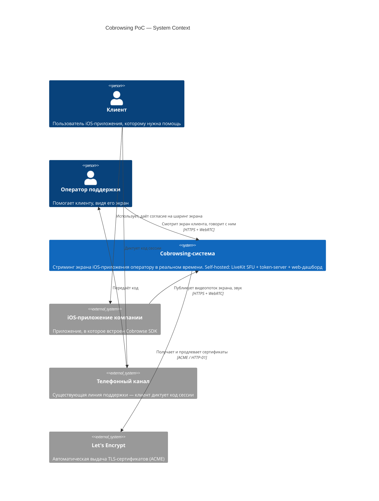
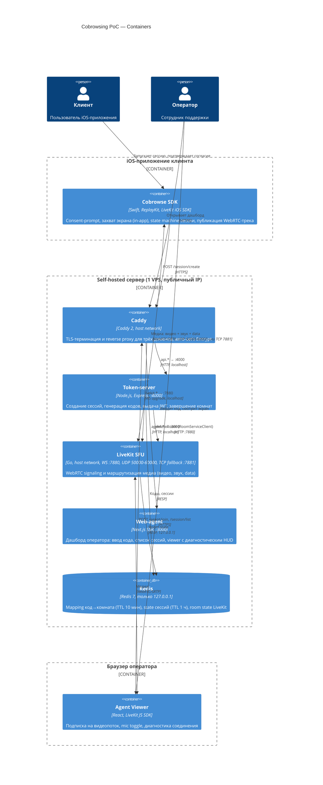
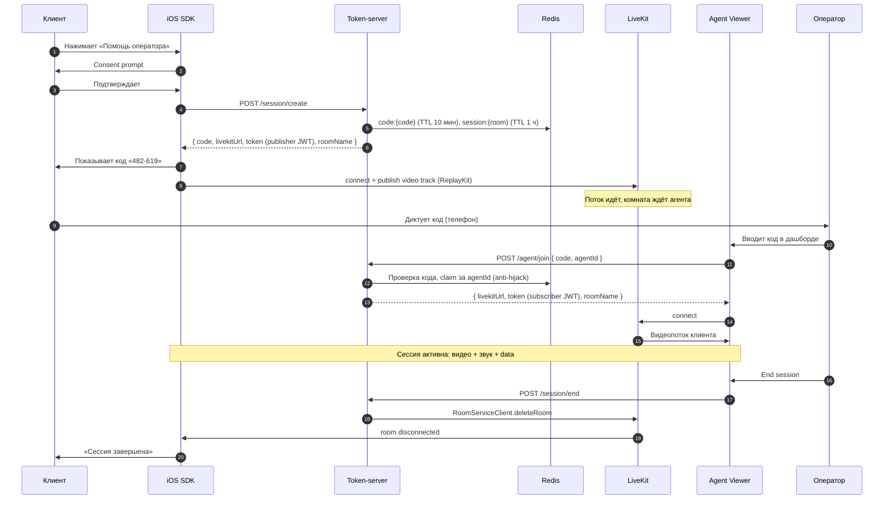

# Архитектурный обзор решения

Документ описывает архитектуру cobrowsing-решения, протестированного в рамках
Proof of Concept. Смежные документы: [тестовый стенд](test-stand.md),
[безопасность](security.md), [развёртывание](deployment.md).

## 1. Назначение и скоуп

**Задача:** оператор техподдержки видит экран iOS-приложения клиента в реальном
времени и голосом помогает пройти сценарий. Клиент явно даёт согласие и диктует
оператору короткий код сессии.

**Подход:** video-streaming cobrowsing — экран приложения захватывается через
ReplayKit (in-app capture, только своё приложение) и передаётся как WebRTC
видеопоток через self-hosted SFU (LiveKit) в браузер оператора. Референс —
Cobrowse.io.

**Скоуп PoC:** один VPS, одна ветка, без HA/staging/secret-manager. Цель —
подтвердить работоспособность связки iOS ReplayKit → WebRTC → SFU → браузер
на реальной инфраструктуре с TLS и реальными сетями (LTE, Wi-Fi, корпоративные).

## 2. Решение в двух абзацах

Клиент нажимает «Помощь оператора» в приложении, подтверждает согласие и
получает 6-значный код. SDK начинает публиковать видеопоток экрана в комнату
LiveKit. Клиент диктует код оператору (по телефону), оператор вводит его в
web-дашборде и подключается к той же комнате как подписчик. Двусторонний звук —
опционально, тем же WebRTC-соединением.

Вся инфраструктура self-hosted: LiveKit SFU (медиа), Node.js token-server
(JWT и жизненный цикл сессий), Redis (state), Next.js web-agent (интерфейс
оператора), Caddy (TLS-терминация). Никакие данные не проходят через сторонние
сервисы — это ключевое требование для enterprise-заказчиков (финсектор,
healthcare).

## 3. C4 Level 1 — System Context

Границы системы: cobrowsing-система не имеет собственной пользовательской базы
и аутентификации клиентов — она встраивается в существующее приложение и
существующий процесс поддержки. Единственная точка сопряжения с внешним миром —
код сессии, передаваемый по внеполосному каналу (телефон).

## 4. C4 Level 2 — Container

Замечания к диаграмме:

- **Caddy и LiveKit работают в `network_mode: host`** — это осознанное решение,
  без которого UDP-медиа и cross-bridge маршрутизация на Ubuntu с ufw не
  работают надёжно. Backend и web-agent — в bridge-сети, наружу публикуются
  только на loopback (диагностика с самого VPS).
- **Медиа не проходит через Caddy.** TLS-терминация только для HTTP/WS
  (signaling и API). Медиапоток шифруется самим WebRTC (SRTP/DTLS) и идёт
  напрямую клиент ↔ LiveKit по UDP/TCP.
- **Три домена** (`livekit.*`, `api.*`, `agent.*`) обслуживаются одним Caddy
  на одном IP — разделение по hostname.

## 5. Жизненный цикл сессии

Свойства протокола, проверенные на стенде:

- `/agent/join` **идемпотентен** по паре (code, agentId): F5 в браузере, React
  StrictMode double-mount и сетевые ретраи не ломают сессию. Код, занятый
  другим агентом, возвращает 409.
- **iOS state machine restartable**: `idle → requestingConsent → connecting →
  streaming → ended/error`, из любого терминального состояния можно стартовать
  заново без перезапуска приложения. Авто-reconnect LiveKit отражается как
  `reconnecting(code)`.
- Завершить сессию может любая сторона; комната c пустым составом удаляется
  сервером через 5 минут (`empty_timeout`).

## 6. Ключевые архитектурные решения

### 6.1 Self-hosted LiveKit, а не managed-сервис

Полный контроль над данными (требование финсектора/healthcare), фиксированная
стоимость VPS вместо per-minute pricing, готовность к enterprise-запросу
«разверните в нашем VPC». Цена: сами отвечаем за эксплуатацию, мониторинг и
масштабирование. Миграция на LiveKit Cloud возможна без изменения клиентского
кода.

### 6.2 LiveKit, а не mediasoup/Janus/raw libwebrtc

Production-ready SDK для всех платформ, встроенная JWT-аутентификация,
server SDK для управления комнатами, Egress-сервис для будущей записи,
Apache 2.0. Это самый быстрый путь к работающему PoC.

### 6.3 Транспорт изолирован за протоколом `CobrowseTransport`

Единственный файл с `import LiveKit` — `ios/.../LiveKitTransport.swift`.
Бизнес-логика (`CobrowseClient.swift`) работает через транспорт-нейтральный
контракт. Смена транспорта (raw libwebrtc, mediasoup) — замена одного файла и
одной строки в `convenience init`. Это страховка от vendor lock-in на уровне
кода, дополняющая self-hosted подход на уровне инфраструктуры.

### 6.4 Video-streaming (ReplayKit), а не scene-graph

Захватываем пиксели экрана, а не дерево UI-элементов. Осознанный trade-off:

| | Video-streaming (наш выбор) | Scene-graph (Cobrowse.io) |
|---|---|---|
| Сложность реализации | Низкая — ReplayKit + WebRTC | Высокая — сериализация UI |
| Redaction (маскирование PII) | Сложно, пост-фактум по областям | Архитектурно встроено (private-by-default) |
| Bandwidth | Выше (видеокодек) | Ниже (диффы дерева) |
| Точность отображения | Пиксель-в-пиксель, включая WebView/канвас | Зависит от покрытия типов элементов |

Для PoC скорость реализации важнее. Redaction — главный известный долг подхода
(см. [security.md](security.md)).

### 6.5 TURN отключён

SFU на публичном IP + открытый UDP-диапазон + TCP fallback :7881 покрывают
~95% сетей. TURN нужен только для сетей «только TCP/443» и части CGNAT —
шаблон конфига закомментирован в `infra/livekit.yaml`, включение — 15 минут.

### 6.6 Host networking для LiveKit и Caddy

Docker bridge ломает WebRTC UDP (NAT внутри NAT) и cross-bridge маршрутизацию
при включённом ufw. LiveKit и Caddy работают в `network_mode: host`; Redis,
backend и web-agent — в bridge с публикацией только на 127.0.0.1.

### 6.7 Разделение LIVEKIT_URL / LIVEKIT_INTERNAL_URL

`LIVEKIT_URL` — адрес, который получают клиенты (wss через Caddy).
`LIVEKIT_INTERNAL_URL` — куда сам backend ходит за RoomServiceClient
(http://host.docker.internal:7880, минуя TLS-фронт). Оба задаются явно,
без «умных» fallback в коде.

### 6.8 Fail-fast конфигурация

Все env-переменные backend — обязательные, дефолтов в коде нет: сервер падает
на старте с «Missing env: X» вместо тихой работы со случайным значением.
Единый источник конфига — `.env` файл на стенде.

## 7. Ограничения PoC

Осознанно не реализовано (и не тестировалось): HA/мультинодовость, staging,
запись сессий (Egress), remote control (управление экраном клиента),
аннотации оператора поверх видео, redaction PII, RBAC операторов,
интеграция с CRM/helpdesk. Часть из этого — кандидаты на следующую итерацию,
оценка гэпов по безопасности — в [security.md](security.md).

## 8. Требования к ресурсам

| Масштаб | CPU | RAM | Канал |
|---|---|---|---|
| PoC (до 10 одновременных сессий) | 2 vCPU | 4 GB | 100 Мбит/с |
| Pilot (до 50 сессий) | 4 vCPU | 8 GB | 500 Мбит/с |
| Prod (100+ сессий) | 8+ vCPU, multi-node | 16+ GB | 1 Гбит/с+ |

Узкое место SFU — bandwidth, не CPU. Текущий стенд (Hetzner CX22: 2 vCPU/4 GB)
соответствует строке «PoC» — детали в [test-stand.md](test-stand.md).
