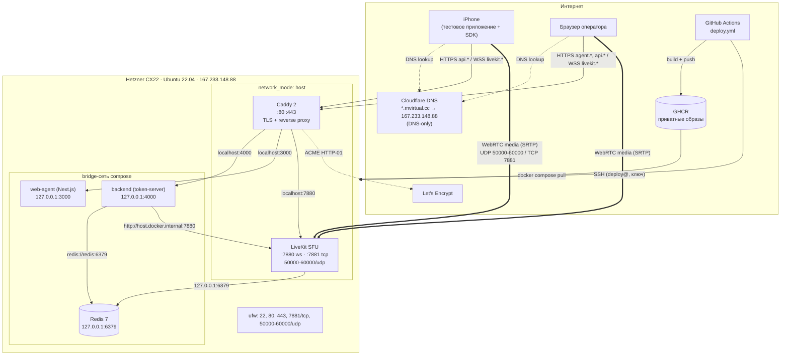
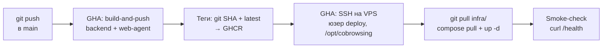

# Тестовый стенд

Описание инфраструктуры, на которой проводилось тестирование PoC.
Архитектура решения — в [architecture.md](architecture.md), пошаговое
развёртывание — в [deployment.md](deployment.md), безопасность —
в [security.md](security.md).

## 1. Состав стенда

| Компонент | Что используется |
|---|---|
| VPS | Hetzner Cloud CX22 — 2 vCPU, 4 GB RAM, Ubuntu 22.04 |
| Публичный IP | 167.233.148.88 (IPv4), 2a01:4f8:1c1e:8653::1 (IPv6) |
| DNS | Cloudflare, режим DNS-only (серое облако, без проксирования) |
| Домены | `livekit.mvirtual.cc`, `api.cobrowse.mvirtual.cc`, `agent.cobrowse.mvirtual.cc` |
| TLS | Let's Encrypt, автоматически через Caddy (ACME HTTP-01) |
| Реестр образов | GHCR (приватные): `ghcr.io/<owner>/cobrowsing-poc-{backend,web-agent}` |
| CI/CD | GitHub Actions: push в `main` → build → GHCR → SSH-деплой |
| Клиент | Реальный iPhone (Simulator не эмитит фреймы ReplayKit) |
| Оператор | Chrome / Safari на десктопе |

Cloudflare используется только как DNS-провайдер: проксирование (оранжевое
облако) выключено намеренно — WebRTC-медиа и WS-signaling должны идти напрямую
на VPS, а Caddy сам управляет сертификатами.

## 2. Схема развёртывания

## 3. Сетевая конфигурация

### Порты, открытые наружу (ufw + Hetzner Cloud Firewall)

| Порт | Протокол | Назначение |
|---|---|---|
| 22 | TCP | SSH (администрирование + деплой от GHA) |
| 80 | TCP | ACME challenge, редирект на 443 |
| 443 | TCP | HTTPS/WSS: API, дашборд, LiveKit signaling |
| 7881 | TCP | LiveKit TCP fallback для сетей с заблокированным UDP |
| 50000–60000 | UDP | WebRTC media |

### Закрыто наружу (доступ только с localhost)

| Порт | Сервис | Как используется |
|---|---|---|
| 7880 | LiveKit WS | Через Caddy (wss://livekit.mvirtual.cc) |
| 4000 | Token-server | Через Caddy (https://api.cobrowse.mvirtual.cc) + smoke-check с VPS |
| 3000 | Web-agent | Через Caddy (https://agent.cobrowse.mvirtual.cc) |
| 6379 | Redis | Только 127.0.0.1 (LiveKit host-mode) и bridge-сеть (backend) |

TURN (3478/UDP, 5349/TCP) не открыт — TURN отключён, см.
[architecture.md, §6.5](architecture.md).

## 4. CI/CD

Свойства пайплайна:

- Триггер — изменения в `backend/`, `web-agent/`, `infra/` или самом workflow;
  правки `ios/` и `docs/` деплой не запускают.
- Каждый образ тегируется полным git SHA — **rollback** = вписать старый тег
  в `IMAGE_TAG` в `.env` на VPS и `compose up -d`.
- Деплой идёт от непривилегированного пользователя `deploy` (в группе docker),
  по отдельному SSH-ключу, живущему только в GitHub Secrets.
- `NEXT_PUBLIC_API_URL` зашивается в бандл web-agent на этапе сборки
  (build-arg), на рантайме не переопределяется.
- Полный цикл push → обновлённый прод — около 2 минут.

Конфигурация стенда живёт в `/opt/cobrowsing/infra/.env` на VPS (домены, ключи
LiveKit, PUBLIC_IP, GHCR_OWNER). LiveKit API-ключ дублируется в `livekit.yaml`
и синхронизируется при деплое.

## 5. Локальный dev-стенд

Помимо прод-стенда, существует локальный вариант без TLS
(`infra/docker-compose.dev.yml` + `infra/.env.dev`): всё на 127.0.0.1,
web-agent и backend с hot reload, реальный iPhone подключается по LAN-IP.
Особенности и workaround'ы dev-окружения (Docker Desktop for Mac и host
networking, Safari mDNS-обфускация ICE-кандидатов, getUserMedia на insecure
origin) описаны в `docs/HANDOFF.md` и `infra/README.dev.md` — в проде за счёт
реальных доменов и HTTPS эти проблемы отсутствуют.

## 6. Что проверялось на стенде (acceptance)

- Все 5 контейнеров `Up (healthy)`; `https://api.cobrowse.mvirtual.cc/health`
  → `{"ok":true}`; `https://livekit.mvirtual.cc/` → 200 + `X-LiveKit-Version`.
- Сканирование извне: открыты только 22, 80, 443, 7881; 4000 и 6379 недоступны.
- E2E: реальный iPhone (LTE и Wi-Fi) → прод-API → оператор в браузере видит
  экран, двусторонний звук работает (secure context).
- `git push` в main → через ~2 минуты `/health` отдаёт свежий build.
- Идемпотентность `/agent/join`: F5, повторные подключения, anti-hijack (409
  при чужом agentId).
